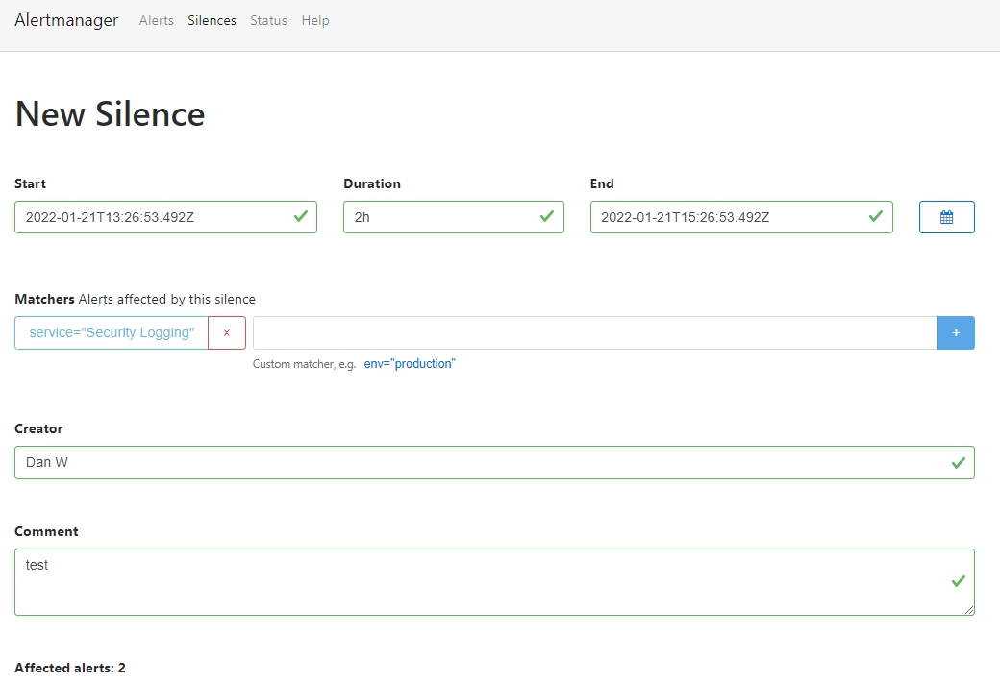

# Stop all alerts from alertmanager (Maintenance mode)

## Table of contents

- [Accessing the alert manager UI](#accessing-the-alert-manager-ui)

---

### Accessing the alert manager UI

1. Connect to the cluster by following the instructions in the [main readme](../README.md).
2. Run 
```sh
kubectl get pods -n <KUBERNETES_NAMESPACE>
```

3. Copy the name of the alertmanager pod, it should look similar to:
```
mojo-<<env>>-ima-alertmanager-1abcd22e33-aa1bc
```
4. run 
```sh
kubectl port-forward YOUR_ALERTMANAGER_POD_NAME -n KUBERNETES_NAMESPACE 9093:9093
```
5. Browse to localhost:9093.
6. Click on _Silences_, click _New Silence_.
7. Populate the fields to configure and enable a silence for your desired time frame.  See below example:  




